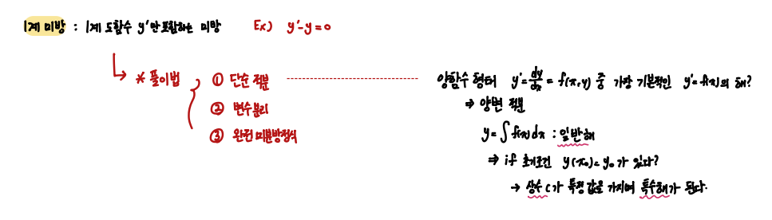
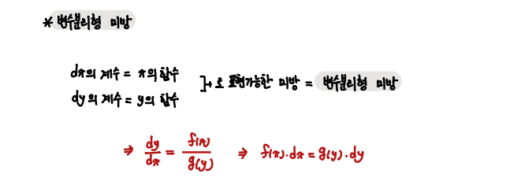
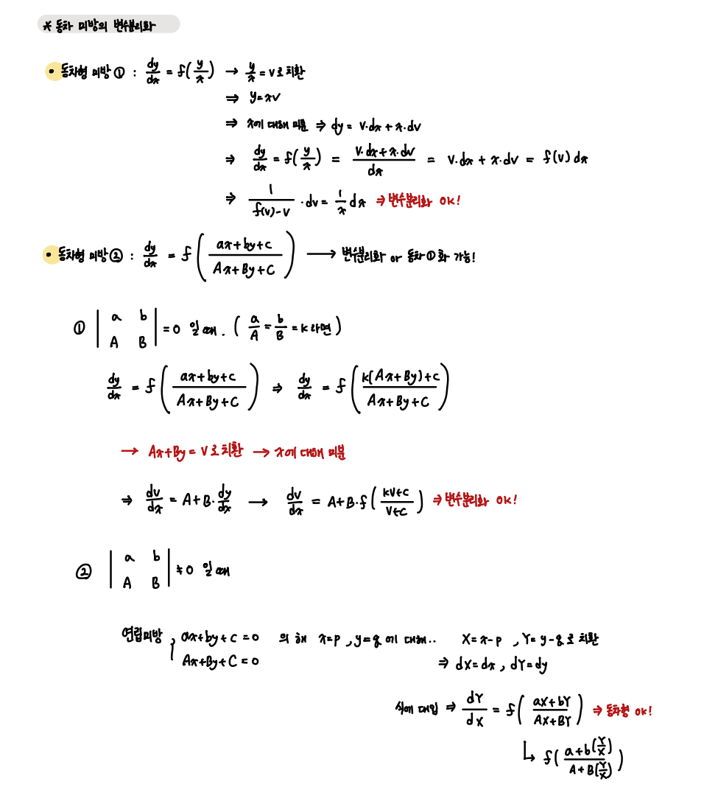
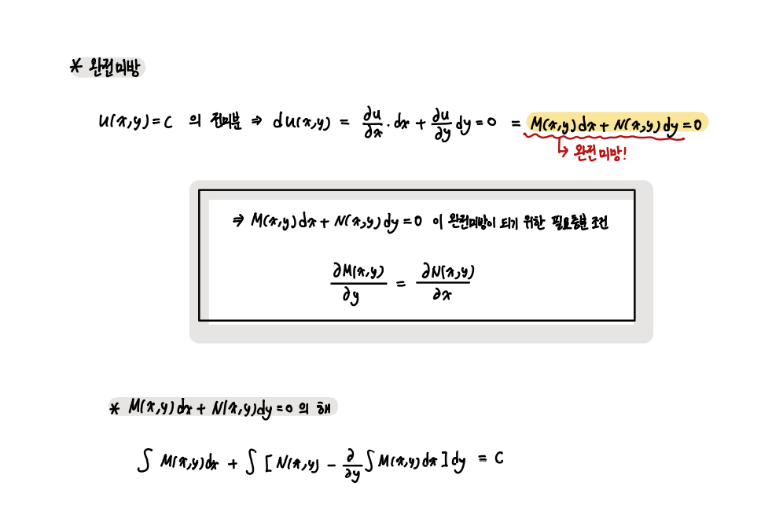
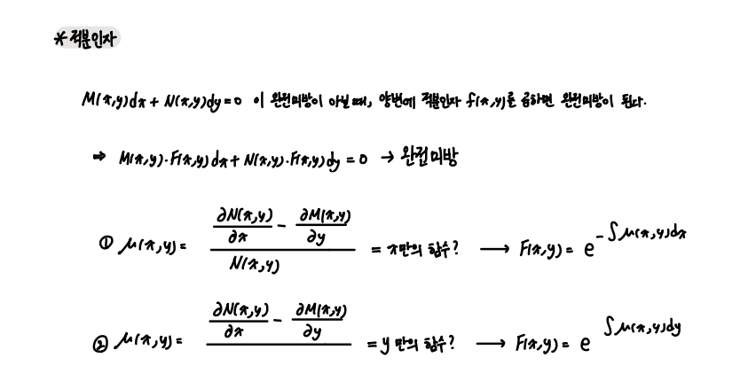
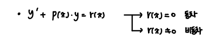
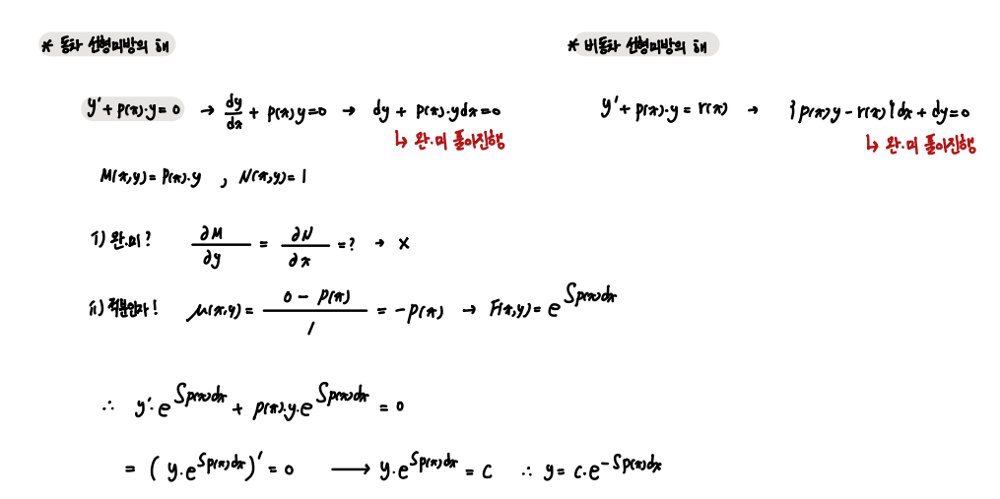
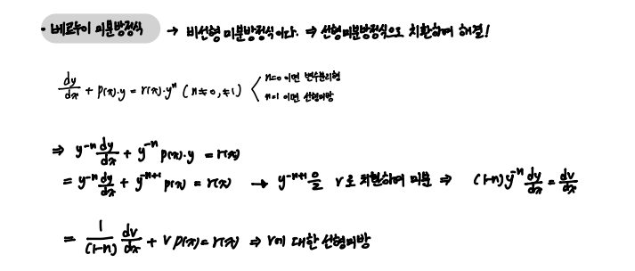
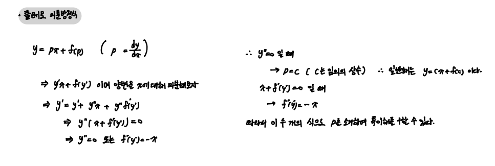

### 1계 미분방정식

1계 미분방정식을 해결하는 방법은 크게 다음 세 가지이다.

      1. 단순 적분
      2. 변수분리
      3. 완전미분방정식

---

#### 1계 미분 방정식을 푸는 도구들 

 

- 변수분리형 미분방정식

위의 꼴로 나타낼 수 있다면 변수분리형이라 한다.

 

아래와 같은 꼴을 하고 있는 함수도 변수분리화 시킬 수 있다. 

 

- 완전 미분방정식

어느 구간 I 내에서 연속인 u(x,y) = c 함수가 존재하고, 이에 대한 전미분이 다음과 같이 나타내질 수 있다면 `완전 미분방정식`이라 한다. 

어느 방정식이 주어져있을 때, 그것이 완전 미분방정식이 되기 위한 필요충분조건이 있으니 제일 먼저 확인하자.

 

만일 완전 미분방정식이 아니라면, `적분 인자`를 사용하여 완전미분방정식으로 만들 수 있다. 

 

    따라서 1계 미분방정식은 

    1. 단순 적분 
    2. 변수분리 꼴 
    3. 완전미분방정식 꼴    로 만들어 해결할 수 있다. 

 

--- 

#### 1계 선형 미분방정식의 해

    선형 미분방정식을 주로 다루며, 비선형 미방을 선형 미방으로 근사시켜 푸는 방법을 통해 비선형을 해결한다.

1. 동차 선형 미분방정식
2. 비동차 선형 미분방정식
3. 베르누이 미분방정식 - `비선형 미방을 선형 미방으로 바꾸어 해결`
4. 리카티 미분방정식 - `특수해 필요`
5. 클레로 미분방정식 

 

- 1계 선형 미분방정식

1계 선형 미방은 다음과 같이 1계 도함수를 포함한 미분방정식이다. 

동차항이 0이라면 동차 미방, 그렇지 않다면 비동차 미방이다.

 

- 동차 미분방정식, 비동차 미분방정식의 해 

    두 미분방정식 모두 완전미분방정식 풀이법으로 해결한다.

 

- 베르누이 미분 방정식

 

- 클레로 미분 방정식

