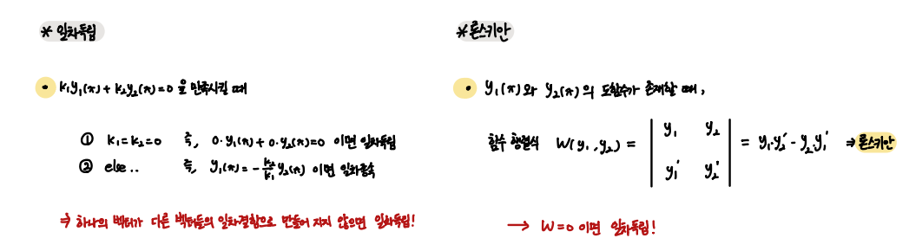
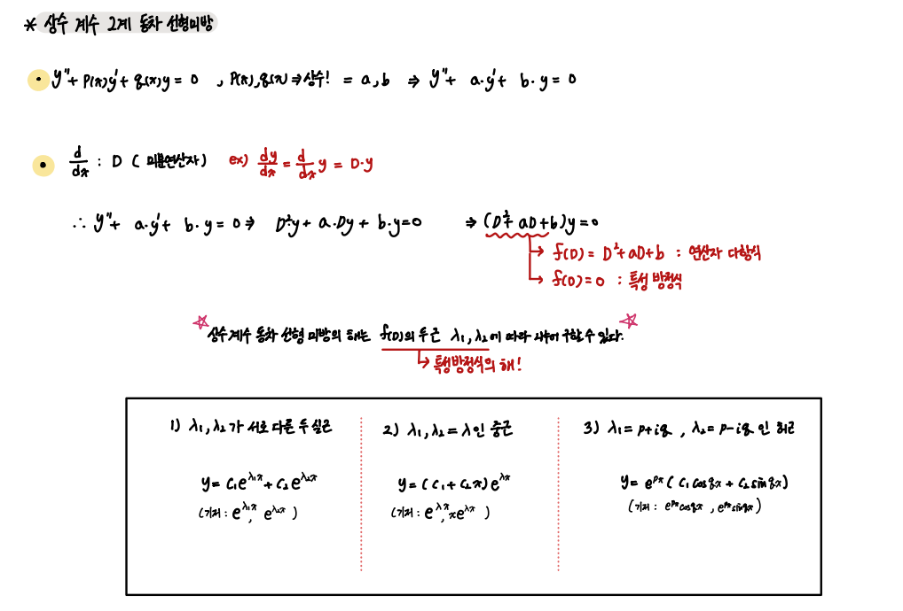
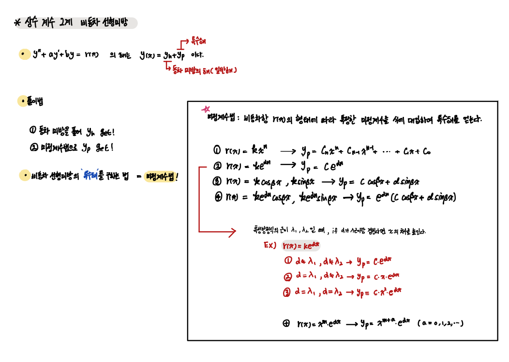
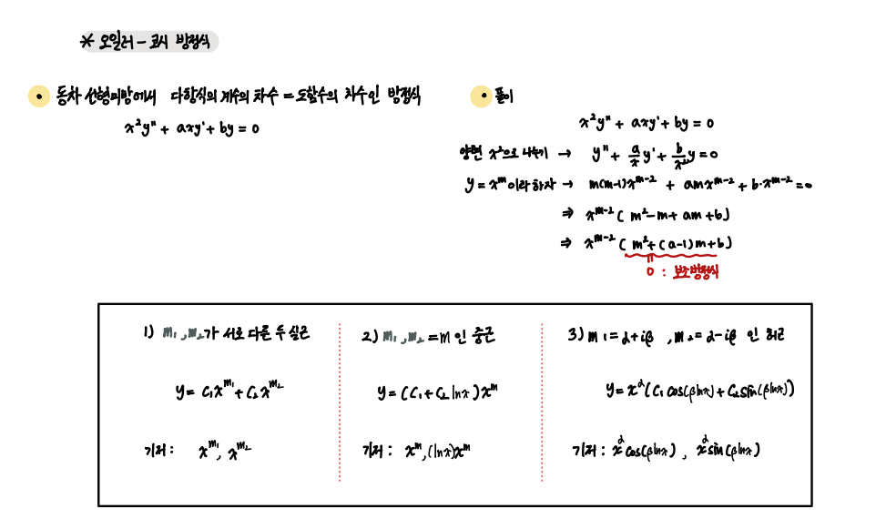

### 2계 미분방정식

`2계 미분방정식은 선형 미분방정식을, 그리고 주로 상수 계수 선형 미분방정식을 다룬다.`

- 2계 선형 미분방정식
- 일차독립 그리고 론스키안
- 상수 계수 동차 2계 선형 미분방정식
- 상수 계수 비동차 2계 선형 미분방정식
- 오일러-코시 미분방정식

위 방정식들은 `Circuit Theory에서 damping part`에서 다루므로 그 부분과 잘 연관시켜 이해하자.

---

 

- 2계 선형미분방정식

2계 도함수를 포함한 미분방정식을 `2계 미분방정식`이라고 한다.

또한 계수들이 모두 x만의 1차 함수들로 이루어져있으면 `2계 선형 미분방정식`이다.

 

- 일차독립 그리고 론스키안

일차독립은 굉장히 중요한 개념이다.

    한 벡터가 다른 벡터의 상수배로 만들어지지 않는다면, 이 벡터들은 서로 일차독립이라 한다.

 

여기서 2계 동차 선형 미분방정식의 경우 만약 두 해가 y1, y2이고 일차독립이라면     
`이들의 일차결합들이 바로 일반해가 된다.`

 

- 상수 계수 2계 동차 선형 미분방정식

      특성방정식의 해의 종류에 따라 일반해를 구할 수 있다. 3개의 Type이 있으므로 잘 골라서 적용하자.

 

- 상수 계수 2계 비동차 선형 미분방정식

상수 계수 2계 비동차 선형 미방 해는 동차 미방의 일반해와 비동차 미방의 특수해로 이루어진다. 

`y = yh+ yp`

    yh : 상수 계수 2계 동차 선형 미방의 일반해 
    yp : 상수 계수 2계 동차 선형 미방의 특수해

특수해를 구하는 방법은 `미정계수법`이다 !

 

- 오일러-코시 미분방정식

오일러-코시 미분방정식의 다항식 계수의 차수와 미분의 차수가 같은 미분방정식이다.

