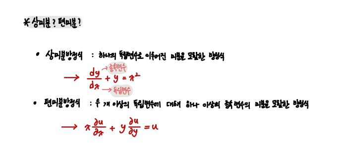

### 미분방정식

`Circuit, Dynamics에서 미분방정식을 잘 사용하기 위해 공학수학에서 공부한 내용을 다시 정리`

연립미분방정식, 차수축소법 등의 내용은 아직 잘 사용하지 않으므로 나중에 따로 정리

 

- 1계 미분방정식

       1. 변수분리
       2. 완전미분방정식
       3. 적분인자
       4. 선형미분방정식의 해
          - 동차 선형 미분방정식
          - 비동차 선형 미분방정식
          - 베르누이 미분방정식
          - 리카티 미분방정식
          - 클레로 미분방정식

- 2계 미분방정식

        1. 2계 선형미분방정식
        2. 상수 계수 동차 2계 선형 미분방정식
        3. 상수 계수 비동차 2계 선형 미분방정식
        4. 오일러-코시 미분방정식

---

 

#### 미분방정식?

    미분 방정식 : 미분 또는 도함수를 포함한 방정식

- 상미분방정식? 편미분방정식?

 

- 선형 미분방정식? 비선형 미분방정식?

위 식의 계수가 모두 x에 대한 1차식 함수이면 선형 미분방정식이다.

 

- 미분방정식의 해, 상미분방정식의 해 

양함수보다 음함수 꼴을 많이 사용지만, 변수분리형 미방을 해결할 때는 양함수 형을 사용할 것

